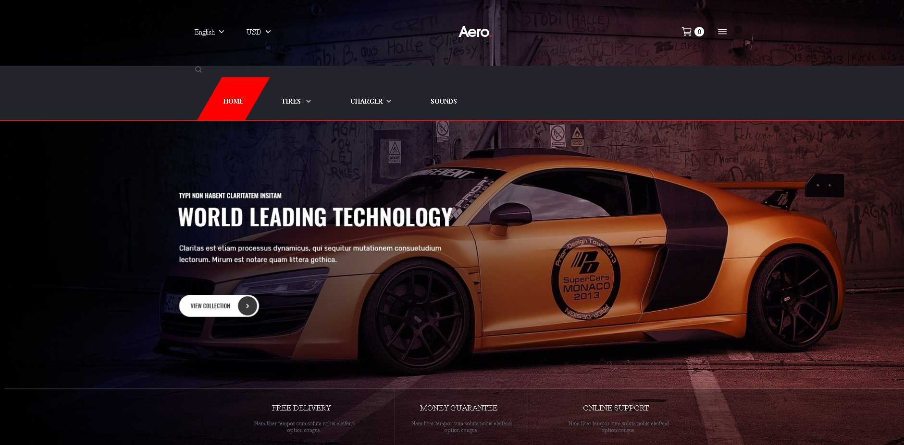

# <a>🏎️ Aero | Car-Accessories-Website</a>

<h3>Special Design --Practice JS Template </h3>

<menu>
  <li>A Practice Design Template, Mainly Focused on practical Javascript.</li>
  <li>LocalStorage To Save User Settings, and take defaults when reload.</li>
  <li>Randomly Change Background images at time intervals.</li>

</menu>

# Js Practice Template

<pre>
1st Day: 11/2/2022
first Dev session:      08:12 AM    ~   09:32 AM        ~ 00h 00m

2st Day: 12/2/2022
first Dev session:      02:12 PM    ~   02:23 PM        ~ 00h 00m
second Dev session:     06:28 PM    ~   06:35 PM        ~ 00h 00m
third Dev session:      07:47 PM    ~   10:48 PM        ~ 00h 00m

</pre>

<pre><q>Challenge Completed in   00h 00m</q></pre>

 
 
 

    
Website Stats Report

    

 
 

TODO:

- [x] two headers
- [ ] headers buttons js click Functionality
- [ ] header search bar icon .js
- [ ] landing page text , btn , change dynamically

- Original Design: demo.posthemes.com/pos_aero/layout3
   
   
   
  🍬 Leave a :star:&nbsp;if you like it, Please!🤩

 

📫 Please hit me up at mohammed.yuossry@gmail.com if you have any feedback or improvements.
